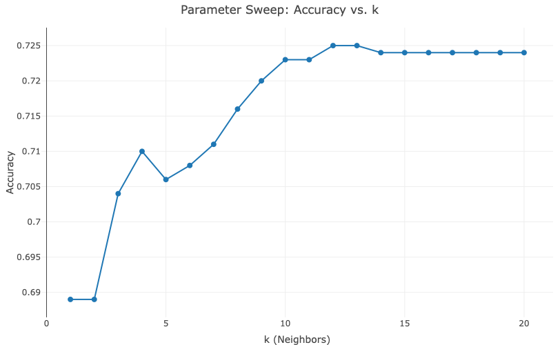
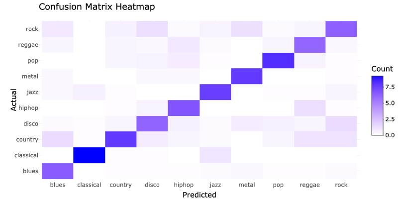
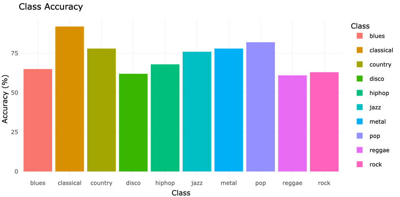

# Introduction

In this case study, I will design and document an `R Shiny`[@shiny] Machine Learning application, deploy it to shinyapps.io and explain the chosen data and algorithm. The overall goal of this case study is to become familiar with R shiny applications, as well as realizing a full data science project life cycle in the context of a machine learning project.

This particular project demonstrates the development of a Music Genre Classifier in R, using the kknn R package and the GTZAN dataset. I chose the topic of music genre classification because I am a big music nerd and have always been interested in understanding how streaming services like Spotify or Soundcloud categorize unlabeled music and use the findings to create genre specific playlists and recommendations for users/listeners.

The result of this case study, the GTZAN knn genre classifier application, provides interactive controls for parameter tuning, enabling users to explore the impact of various settings on model performance.

# Dataset Overview

## About the Dataset

The dataset I used is the `GTZAN Dataset`[@GTZAN], which is widely known as the "MNIST of sounds". It is a well known benchmark dataset in music genre classification and provides a standardized collection of audio files and their corresponding features. It contains:

-   **10 genres**, with 100 audio files each, all of which are 30 seconds long.
-   Two CSV files:
    -   One with mean and variance computed for each feature over the entire 30-second audio file.
    -   One with similar features computed over 3-second audio slices, resulting in more data points.
-   **Features include**:
    -   MFCC (Mel-Frequency Cepstral Coefficients): Represents timbral properties.
    -   Spectral features (e.g., spectral centroid, bandwidth, and roll-off).
    -   RMS (Root Mean Square) energy and chroma features, capturing audio intensity and pitch class.

For this application, I used the `features_30_sec.csv` file, which contains 1000 preprocessed representations of 30 second long music clips. The following table shows a sample row from the `features_30_sec.csv` file:

```{r echo = FALSE, message = FALSE, warning = FALSE}
library(flextable)
library(dplyr)
library(tibble) 

data <- read.csv("features_30_sec.csv")

# vertical transpoition for readability
vertical_data <- data %>%
  head(1) %>%                  
  t() %>%                   
  as.data.frame()        

vertical_data <- vertical_data %>%
  rownames_to_column("Feature") %>%
  rename(Value = 1) 

ft <- flextable(vertical_data) %>%
  set_caption("Example Row from `features_30_sec.csv` (transposed)") %>%
  theme_vanilla() %>%
  autofit()

ft
```

The classifier (when all Feature Groups are selected) does not use the "filename" field, as it contains the label and is non numerical. No other preprocessing (other than removing the mentioned filename) is done to the values.

## Data Exploration and Feature Descriptions

As mentioned before, the GTZAN dataset provides a variety of different numerical features for each datapoint. In order to better understand the significance of the different features, the following section provides short descriptions and examples how the would translate to audible aspects of the music. This is where (my) musical and audio-engineering background knowledge comes in handy!

**Spectral and Energy Features**

-   chroma_stft_mean: Average chroma short-time Fourier transform (STFT), representing pitch class intensity (e.g., C, C#, D) over time.
-   chroma_stft_var: Variance of chroma STFT, indicating variability in pitch class intensity across the file.
-   rms_mean: Root Mean Square energy, representing the average loudness of the audio signal.
-   rms_var: Variance of RMS energy, indicating loudness fluctuations.
-   spectral_centroid_mean: Represents the "center of mass" of the spectrum, often related to the perceived brightness of the sound.
-   spectral_centroid_var: Variance of spectral centroid, showing how brightness varies over time.
-   spectral_bandwidth_mean: The width of the spectrum, indicating how spread out frequencies are around the spectral centroid.
-   spectral_bandwidth_var: Variance of spectral bandwidth, showing variability in the spread of frequencies.
-   rolloff_mean: The frequency below which 85% of the spectral energy is concentrated, representing high-frequency dominance.
-   rolloff_var: Variance of the rolloff frequency, indicating fluctuations in high-frequency energy.
-   zero_crossing_rate_mean: Average rate of zero-crossings in the waveform, often associated with noisiness or sharpness.
-   zero_crossing_rate_var: Variance of zero-crossing rate, showing how noisiness varies.

**Harmonic and Perceptual Features**

-   harmony_mean: Average harmony value, indicating harmonic content in the signal (e.g., chord-related information).
-   harmony_var: Variance of harmony values, showing how harmonic content changes over time.
-   perceptr_mean: Average perceptual value, potentially related to perceived loudness or tonal quality.
-   perceptr_var: Variance of perceptual values, showing changes in tonal characteristics.
-   tempo: The tempo of the music in beats per minute (BPM).

**MFCC (Mel-Frequency Cepstral Coefficients)**

`MFCCs`[@MFCC] are created trhrough mapping audio signals to the mel scale, which tries to model the frequency response of human hearing. Then, a Fourier transform is applied, and coefficients that summarize the spectral characteristics are extracted. MFCCs are also used in other audio analysis, such as speech classification.

-   mfcc1_mean, mfcc2_mean, ..., mfcc20_mean: The average value of each MFCC feature that captures various timbral aspects of the sound. Example: mfcc1_mean might represent overall energy, other MFCCs can capture finer details of timbre etc. mfcc1_var, mfcc2_var, ..., mfcc20_var: The Variance of each MFCC features value showing how much the timbral properties fluctuate over time.

**Target Label**

-   label: The genre of the audio file. For example, blues is the genre associated with this file. (Yes this is trivial, but we need it for the classification!).

### Why This Dataset?

Representing audio content for a machine learning model is a non trivial process, and combining the fields of audio processing and machine learning poses a variety of challenges. For example, just the process of analyzing the frequency spectrum of an audio file over time requires additional code development and is not guaranteed to be readily available for R. The GTZAN dataset provides an excellent starting point for my project, since essential features of the audio files (such as the aforementioned timbral, spectral and harmonic features) have been preprocessed (including variances and means) and extracted to a handy, numerical .csv dataset. Additionally, GTZAN is very well documented and quite popular in the research field of genre classification, which made the choice easy.

# Methodology

## Algorithm Selection: k-Nearest Neighbors (k-NN)

### Why k-NN?

I choose k-Nearest Neighbors (k-NN) because of its simplicity, which also translates to the computational ressources required to run it on this dataset. Since I do not have access to a powerful GPU (and assumed the same for the container that would be deployed and run on shinyapps.io), I opted to explore this rather "naive" approach to genre classification. This aligns with best-practice we learned in the lecture, which taught us to start with a simple model and expand (or replace it with a more complex approach) if it does not work. (Luckily for us, it works fairly well in this instance - more on that later!)

### Mathematical Details

`k-Nearest Neighbors`[@knn] (k-NN) is a simple classification method without an explicit training phase, meaning that the model can be run adhoc and only relies on the presence of the training dataset. When a new query point (which in our instance would be a row of the features_30_sec.csv) is given, the algorithm calculates the distances between the query point (in a high dimensional space) and all points in the training dataset. The (via distance metric discovered) $k$ closest neighbours then vote with their class according to the selected weighting metric, and the query point is assigned the same class as the majority vote. This process is repeated for the number of Cross-validation folds (with different training sets), and the accuracy of the model is determined by the average of all folds results.
This application uses the `kknn`[@kknn] R package implementation.

1.  **Distance Metrics:**

    -   **Euclidean Distance:** $$
        d(x, y) = \sqrt{\sum_{i=1}^n (x_i - y_i)^2}
        $$ Measures the straight-line distance between two points in space.

    -   **Manhattan Distance:** $$
        d(x, y) = \sum_{i=1}^n |x_i - y_i|
        $$ Computes the distance by summing absolute differences along each dimension, like navigating a grid.

2.  **Weighting Schemes:**

    -   **Uniform:** Each neighbor contributes equally, assigning a weight of 1 to all neighbors regardless of distance.

    -   **Triangular:** Weights decrease linearly with distance, giving closer neighbors more influence: $$
        w_i = 1 - \frac{d_i}{d_{\text{max}}}
        $$ where $d_i$ is the distance of the $i$-th neighbor, and $d_{\text{max}}$ is the maximum distance among the $k$-nearest neighbors.

    -   **Gaussian:** Follows a Gaussian distribution, assigning exponentially higher weights to closer neighbors: $$
        w_i = \exp\left(-\frac{d_i^2}{2\sigma^2}\right)
        $$ where $\sigma$ controls the spread of weights.

    -   **Epanechnikov:** Uses a parabolic function to assign weights, setting weights to 0 for neighbors beyond a cutoff distance: $$
        w_i = \max\left(0, 1 - \left(\frac{d_i}{d_{\text{max}}}\right)^2\right)
        $$ This is computationally efficient and reduces the influence of distant points.

3.  **Cross-Validation:** Cross-Validation is a mechanism used to ensure robust performance by splitting the data into multiple training and validation sets. Increasing this can lead to a longer compute, but also more robust classification.

### Parameter Tuning

The model allows users to adjust: 

  - The number of neighbors ($k$)
  - The Distance metric (Euclidean, Manhattan)
  - The Weighting scheme
  - The Number of cross-validation folds

Additionally, a parameter sweep is implemented to determine the optimal $k$ for a selected set of metrics and cross-validation folds.

## Shiny Application Design

The application consists of the following pages:

1.  **Application:**
    -   Parameter settings for k-NN
    -   Model performance metrics
    -   Confusion matrix (summarizes the performance of a classification algorithm by comparing the actual labels with the predicted labels from the model) as well as a heatmap visualization
    -   Class-specific accuracy visualizations
    -   A Scoreboard (Run History) showing the recent model runs
    -   Parameter sweep results (in 2d Graph form)
2.  **About Tab:**
    -   This page, documenting motivation, development and results of the application.

Visualization was realized with R tools such as `ggplot`[@ggplot]2 and `flextable`[@flextable].
# Results
In order to evaluate the performance of the model, I manually ran parameter sweeps for every possible combination of distance and weight metric and tested their respective findings. The following table shows the results (best possible accuracy and $k$) for each of them with a Cross validation fold of 5, which was chosen to balance computation time and robustness of the model.

```{r, echo=FALSE, message=FALSE}
results <- data.frame(
  Run = c("#1", "#2", "#3", "#4", "#5", "#8", "#10", "#11"),
  k = c(4, 12, 5, 11, 3, 12, 4, 9),
  Distance = c("Euclidean", "Euclidean", "Euclidean", "Euclidean", 
               "Manhattan", "Manhattan", "Manhattan", "Manhattan"),
  Weighting = c("Rectangular", "Triangular", "Gaussian", "Epanechnikov", 
                "Rectangular", "Triangular", "Gaussian", "Epanechnikov"),
  Accuracy = c(68.7, 71.0, 70.2, 71.1, 69.6, 72.5, 70.9, 71.9)
)

knitr::kable(
  results,
  col.names = c("Run", "k", "Distance", "Weighting", "Accuracy (%)"),
  caption = "Parameter Sweep Results for k-NN on the GTZAN Dataset"
)
```


## Model Performance
From the conducted sweeps, I conclude that the best configuration for the model is $k = 12$, using Manhattan distance and triangular weighting.

```{r, echo=FALSE}

```

This (optimal) configuration achieves an accuracy of *72.50%*. I assume that this setup performs best because Manhattan distance is able to capture feature difference more robustly compared to Euclidean distance. Additionally, the higher value of k reduces noise by averaging over more neighbors, which helps to smooth out inconsistencies in the dataset which is espescially important in our (relatively) small training dataset of 1000 points. Finally, triangular weighting effectively prioritizes closer neighbors, making the model more sensitive to the most relevant data points in the feature space.

```{r, echo=FALSE}

```

The confusion matrix in this configuration indicates that the classifier generally performs well, with the strongest values lying along the diagonal, meaning it often predicts the correct genre. Especially genres like "Blues" (6.50), "Classical" (9.20), and "Metal" (7.80) show high diagonal values, suggesting they are correctly classified most of the time, which is also supported by the class specific classification accuracy. Among these, "Classical" stands out as the most reliably classified genre, with almost no off-diagonal errors, while "Metal" and "Jazz" also demonstrate strong classification performance. However, there are notable confusions between similar genres, reflected in the off-diagonal values. For example, "Country" is often misclassified as "Disco" (0.70), "Rock" is misclassified as "Pop" (0.40) and vice versa (0.20), and "Hip-hop" is confused with "Reggae" (1.30) and vice versa (0.90). Interestingly, "Blues" is occasionally misclassified as "Classical" (1.40), which might be unexpected given their distinct characteristics (for example: Drums and Rythm). These misclassifications suggest overlapping feature spaces or similar acoustic properties between the genres.

```{r, echo=FALSE}

```

Some genres, like "Rock" (6.30) and "Reggae" (6.10), are harder to classify due to relatively lower diagonal values and higher misclassifications. I assume that these challenges may arise from the shared rhythmic or tonal features between these genres and others in the dataset. The model excels at classifying "Classical" music, likely due to its distinctive features such as low rhythmic variance and high harmonic content, and "Metal," which may stand out because of unique spectral characteristics like high energy in specific frequency ranges. However, overlapping feature distributions among certain genres, such as "Rock," "Pop," and "Reggae," or "Country" and "Disco," might be causing confusion, as these genres likely share similar tempo, pitch, or rhythm patterns.

# Application Deployment

The application is publicly accessible and has been deployed to [shinyapps.io](https://i3073l-julian0hans.shinyapps.io/gtzan_knn/). Users can access it to experiment with parameter settings, train the model interactively and explore performance metrics and visualizations. Additionally, the source code is available at [Github.com](https://github.com/Julian-Hans/gtzan_knn)

# Conclusion and Discussion
This case study successfully demonstrates the power of interactive applications in exploring machine learning models, and helped me understand the process of planning, realizing and deploying a data science application using R and the data science project lifecycle principles. I am surprised to find that my "naive" approach to genre classification using the simle k-nearest neighbour model performs well, as I was expecting an accuracy far below 50%, given the fact that most modern approaches to genre classification use more sophisticated models like RNN or CNN. 
Finding that my classifier applied to the GTZAN dataset achieved its best performance with a configuration of 
$k=12$, Manhattan distance, and triangular weighting, resulting in an accuracy of 72.50%, underscores the importance of carefully selecting hyperparameters and distance metrics tailored to the dataset. I spent most of my time in this project studying the different data points and features, but had a lot of motivation when I found that most of the features are also relevant to music production and audio analysis in general, which are research topics I am very interested in.
Future improvements for my genre classification approach could include exploring more advanced classification models, such as support vector machines (SVMs) or neural networks, which may better capture complex relationships within the dataset. Additionally, augmenting the dataset or incorporating additional features could further enhance the model's performance. Overall, this case study demonstrates how a simple yet effective classification model can provide valuable insights into audio classification tasks and highlights the iterative nature of machine learning model development.

# References

